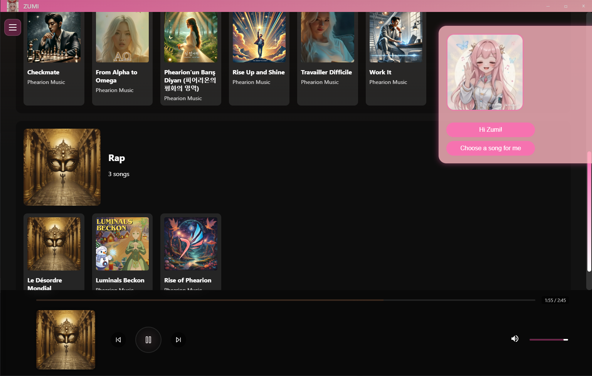

# ZUMI: The first ever E.T.H.I.C.A.L music player 🌸
### The music player of Phearion Music: E.T.H.I.C.A.L Lyrics project.

### About our music:
- Generated by AI fully.
- Lyrics are 100% E.T.H.I.C.A.L, no bad words, no bad content, no bad influence, no drugs, no alcohol, no violence and much more.
- This is a private project that will never be deployed widely. We use it only for our own purposes.

### Features:
- Play music. (obviously) 🎃

### Technologies:
- Typescript
- React
- Electron 
- Sqlite3 (for storing music data)

AND THAT'S IT! 🌈✨

### What's next (dream goal if I HAD MONEY aha):
- I would definitely add a lyrics detector to check if the lyrics are E.T.H.I.C.A.L or not before adding them to the database.
- If we add real human-made music, I would add multiple crawlers to check public information about the artist and the song to make sure it's E.T.H.I.C.A.L. (This include video analysis, lyrics analysis, and much more) (THIS REQUIRES A LOT OF MONEY, so it's just a dream goal :D)
- I would add a feature to detect the mood of the user and play music that fits the mood. (This requires a lot of data and a lot of money, so it's just a dream goal :D)

Note: let's see how far I will go with this project :) I want at least to make a deployed version for my personal use when I am working on my projects.

Wanna see my other projects? Check my [website][https://phanthive.com]